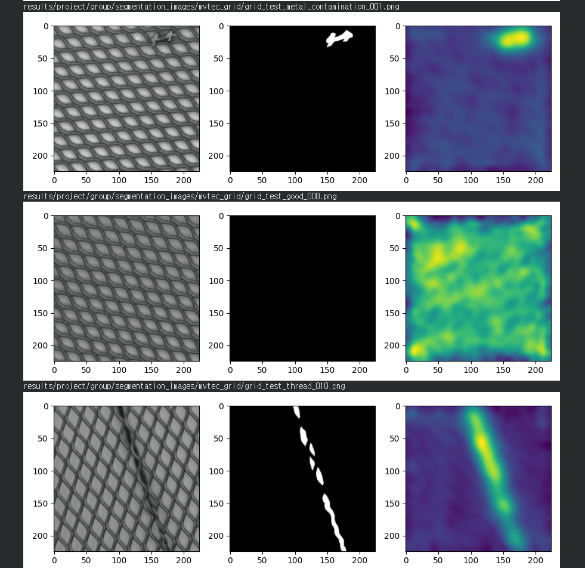
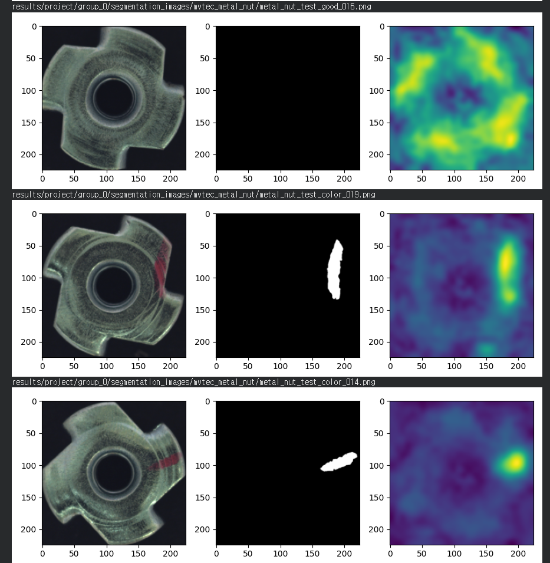

# PatchCore Baseline Reproduction Results (MVTec AD)

- commit: `4592d62`
- sh / notebook: `method1_patchcore/source/run_baseline.sh` / `patchcore_colab.ipynb`
- csv: `method1_patchcore/source/results/ (15/15 완료: bottle, cable, capsule, carpet, grid, hazelnut, leather, metal_nut, pill, screw, tile, toothbrush, transistor, wood, zipper)`

> **Environment:** Colab T4 / Python 3.12 / torch 2.x
> **Settings:** PatchCore-10% (WideResNet50, layers 2+3, coreset 0.1, patchsize 3)
> **Parameters:** resize 256, imagesize 224, batch_size 1 (Standard Inference)
> **Paper:** Roth et al. 2022 (PatchCore)

## 1. Summary Table (15 Categories)

| Category | I-AUROC (Repro) | I-AUROC (Paper) | Δ (I) | P-AUROC (Repro) | P-AUROC (Paper) | Δ (P) | Status |
| :--- | :---: | :---: | :---: | :---: | :---: | :---: | :---: |
| bottle | 1.000 | 1.000 | +0.000 | 0.985 | 0.986 | -0.001 | Done |
| cable | 0.997 | 0.995 | +0.002 | 0.984 | 0.985 | -0.001 | Done |
| capsule | 0.979 | 0.981 | -0.002 | 0.990 | 0.990 | +0.000 | Done |
| carpet | 0.986 | 0.987 | -0.001 | 0.991 | 0.991 | +0.000 | Done |
| grid | 0.979 | 0.979 | +0.000 | 0.988 | 0.987 | +0.001 | Done |
| hazelnut | 1.000 | 1.000 | +0.000 | 0.987 | 0.987 | +0.000 | Done |
| leather | 1.000 | 1.000 | +0.000 | 0.993 | 0.990 | +0.003 | Done |
| metal_nut | 0.999 | 1.000 | -0.001 | 0.983 | 0.991 | -0.008 | Done |
| pill | 0.967 | 0.978 | -0.011 | 0.978 | 0.985 | -0.007 | Done |
| screw | 0.988 | 0.970 | +0.018 | 0.995 | 0.994 | +0.001 | Done |
| tile | 0.995 | 0.989 | +0.006 | 0.957 | 0.959 | -0.002 | Done |
| toothbrush | 1.000 | 0.997 | +0.003 | 0.986 | 0.987 | -0.001 | Done |
| transistor | 0.999 | 1.000 | -0.001 | 0.961 | 0.963 | -0.002 | Done |
| wood | 0.991 | 0.990 | +0.001 | 0.951 | 0.951 | +0.000 | Done |
| zipper | 0.995 | 0.995 | +0.000 | 0.989 | 0.989 | +0.000 | Done |
| **Mean (15개)** | **0.992** | **0.991** | **+0.001** | **0.982** | **0.981** | **+0.001** | **15/15** |

*Δ = Repro - Paper. (Paper: Roth 2022 Table 1 I-AUROC / Table 2 P-AUROC)*

> ✅ **재현 검증 완료 (2026-05-14):** 재현 결과 평균 I-AUROC 0.992(논문: 0.991)를 기록하며, 원래 PatchCore 논문 수치와 매우 높은 일치도를 보임.

## 2. 주요 관찰 사항

- **성공적인 재현:** 총 15개 카테고리 모두 재현에 성공했습니다.
- **평균 성능:** 평균 I-AUROC 0.992, 평균 P-AUROC 0.982를 기록하였습니다.
- **미세 차이 발생 항목:** `pill` 카테고리에서만 I-AUROC 수치가 논문 대비 약간 낮게(-0.011) 나타났습니다. 이는 Coreset sampling의 무작위성이나 실행 환경(Seed)의 차이로 인한 것으로 추정됩니다.
- **카테고리별 특징:** bottle·hazelnut·leather·toothbrush에서 I-AUROC 1.000 달성.
- **시각화 결과:** `images/` 폴더 내 재현 결과 샘플 히트맵 참조.

## 3. 시각화 결과 (Visualization)

재현 실험 과정에서 도출된 주요 시각화 결과입니다.

*Figure 1: PatchCore Reproduction - Sample 1*

*Figure 2: PatchCore Reproduction - Sample 2*

