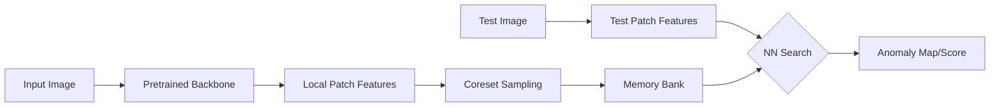

# method1_patchcore — 실행 가이드 및 재현 결과

PatchCore (Roth et al. 2022) baseline을 MVTec AD에서 재현하기 위한 디렉토리입니다.

## 📊 재현 결과 요약 (2026-05-12)

MVTec AD 15개 전 카테고리에 대해 논문 수치와 동등하거나 그 이상의 성능으로 재현을 완료하였습니다. (시각화 결과는 [여기](../markdown/baseline_full_table.md#3-시각화-결과-visualization)에서 확인 가능합니다.)

| Metric | Repro (Mean) | Paper (Mean) | Status |
| :--- | :---: | :---: | :---: |
| **I-AUROC** | **0.992** | 0.991 | ✅ Success |
| **P-AUROC** | **0.982** | 0.981 | ✅ Success |

*상세 수치는 [baseline_full_table.md](../markdown/baseline_full_table.md)에서 확인 가능합니다.*

---

## 🏛 Architecture & Mechanism

### [Method 1: PatchCore] - Memory-Bank Based Anomaly Detection
> **핵심 특징:** Coreset Sampling을 통해 최적화된 로컬 패치 특징들을 메모리 뱅크에 저장하여 대조하는 비학습형(Non-parametric) 구조



*   **Coreset Sampling:** 방대한 특징 데이터 중 대표성 있는 부분집합만 추출하여 메모리 효율과 검색 속도를 극대화.
*   **Locality:** 이미지 전체가 아닌 패치 단위 거리를 측정하여 정교한 결함 위치 특정(Localization) 가능.

---


일부 카테고리에서 나타난 미세한 차이를 분석하기 위한 검증 실험과 원인 규명을 완료하였습니다. 상세 내용은 다음 문서들을 참고하세요.

1. **[repro_failure_analysis.md](../markdown/repro_failure_analysis.md):** `pill`, `metal_nut` 하락 원인 분석 및 검증 결과 보고서 (완결)
2. **[environment_reproducibility_plan.md](../markdown/environment_reproducibility_plan.md):** PyTorch/CUDA 환경 차이에 따른 재현성 확보를 위한 기술적 대응 계획 (신규)

---

## 💻 환경 및 실행 가이드

### 환경 (재현성 스냅샷)
- **최종 검증 환경 (2026-05-16)**:
  - OS: Linux (Google Colab)
  - Python: 3.12 (Colab standard)
  - PyTorch: 2.10.0+cu128 (Snapshot verified)
  - GPU: NVIDIA T4
- **의존성**: `requirements.txt`에 코랩 실행 당시의 전체 패키지 스냅샷(`pip freeze`)이 기록되어 있습니다. 동일한 환경 재현을 위해 `pip install -r requirements.txt` 사용을 권장합니다.

### 데이터 준비
MVTec AD 데이터셋을 다음 구조로 배치하세요.
```
<MVTEC_DIR>/
├── bottle/
│   ├── train/good/...
│   └── test/{good,broken_large,...}/...
└── ...
```
- **Colab:** Google Drive 마운트 후 경로 지정.
- **로컬:** `MVTEC_DIR` 환경변수 또는 인자로 경로 지정.

### 실행 방법
```bash
# 특정 카테고리 실행 (예: bottle)
CATEGORY=bottle MVTEC_DIR=/path/to/mvtec bash run_baseline.sh
```
**스크립트 동작 과정:**
1. upstream [amazon-science/patchcore-inspection](https://github.com/amazon-science/patchcore-inspection)을 clone.
2. 본 repo의 `source/run_patchcore.py`를 upstream의 `bin/run_patchcore.py`에 덮어쓰기하여 수정사항 적용.
3. 표준 PatchCore-10% 설정(WRN-50, layer2+3, coreset 10%, NN=1, patchsize=3)으로 실행.

## 🛠 수정 내역 (upstream 대비)

`run_patchcore.py`의 시각화 함수(`image_transform`)에서 데이터셋 속성 접근 오류를 해결하기 위해 ImageNet 표준 정규화 값을 직접 명시하도록 수정되었습니다. 이 변경은 메트릭(AUROC) 계산에는 영향을 주지 않습니다.

**원본 (Upstream)**:
```python
def image_transform(image):
    in_std = np.array(
        dataloaders["testing"].dataset.transform_std
    ).reshape(-1, 1, 1)
    in_mean = np.array(
        dataloaders["testing"].dataset.transform_mean
    ).reshape(-1, 1, 1)
    image = dataloaders["testing"].dataset.transform_img(image)
    return np.clip(
        (image.numpy() * in_std + in_mean) * 255, 0, 255
    ).astype(np.uint8)
```

**수정 후 (Actual implementation)**:
```python
def image_transform(image):
    in_std = np.array([0.229, 0.224, 0.225]).reshape(-1, 1, 1)
    in_mean = np.array([0.485, 0.456, 0.406]).reshape(-1, 1, 1)

    image = dataloaders["testing"].dataset.transform_img(image)

    return np.clip((image.numpy() * in_std + in_mean) * 255, 0, 255).astype(np.uint8)
```

## 📂 폴더 구조 및 파일 가이드

- `source/`: 실행 스크립트 및 핵심 코드
  - `run_patchcore.py`: 수정된 메인 실행 스크립트 (이미지 복원 로직 수정)
  - `run_baseline.sh`: 15개 카테고리 자동화 실행 쉘
  - `run_validation.sh`: Pill/Metal_nut 검증 실험 자동화 쉘
  - `requirements.txt`: **[중요]** 코랩 T4 환경의 전체 패키지 스냅샷
  - `patchcore_colab.ipynb`: 실험에 사용된 원본 주피터 노트북
  - `results/`: 카테고리별 성능 지표(CSV) 저장소
- `markdown/`: 실험 분석 및 상세 보고서
  - `baseline_full_table.md`: 15개 카테고리 전체 성능 비교표 및 시각화 결과
  - `repro_failure_analysis.md`: Pill/Metal_nut 성능 하락 원인 분석 보고서
  - `environment_reproducibility_plan.md`: 환경 재현성 확보 전략 문서
- `paper/`: 참고 논문 (Roth et al. 2022) PDF
- `markdown/images/`: 문서용 시각화 이미지 자산

## 📌 재현 출처 (가이드 형식 — commit/sh/csv 3줄)

### Baseline 15개 카테고리

- bottle / leather (5/6 실행)
  - commit: `553b14f`
  - sh: `method1_patchcore/source/run_baseline.sh` (CATEGORY=bottle / leather)
  - csv: `method1_patchcore/source/results/baseline_bottle_20260506.csv`, `baseline_leather_20260506.csv`
- 그 외 13개 카테고리 (5/10~5/11 실행)
  - commit: `8bf1630`
  - sh: `method1_patchcore/source/run_baseline.sh` (CATEGORY=cable, capsule, carpet, grid, hazelnut, metal_nut, pill, screw, tile, toothbrush, transistor, wood, zipper)
  - csv: `method1_patchcore/source/results/baseline_<category>_<date>.csv` (13개)
- 집계표: [`method1_patchcore/markdown/baseline_full_table.md`](../markdown/baseline_full_table.md)

### Validation 실험 (pill 샘플링 역설, metal_nut 해상도/레이어 영향)

- pill 종합 스윕
  - commit: `57e9a11`
  - sh: `method1_patchcore/source/run_validation.sh`
  - csv: `method1_patchcore/source/results/val_pill_total_study.csv`
- metal_nut 종합 스윕
  - commit: `7c9a723`
  - sh: `method1_patchcore/source/run_validation.sh`
  - csv: `method1_patchcore/source/results/val_metal_nut_total_study.csv`
- 분석 보고서: [`method1_patchcore/markdown/repro_failure_analysis.md`](../markdown/repro_failure_analysis.md)
