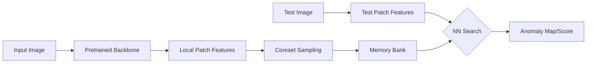

# method1_patchcore — 실행 가이드 및 재현 결과

PatchCore (Roth et al. 2022) baseline을 MVTec AD에서 재현하고 프로파일링하기 위한 디렉토리입니다.

## 📊 재현 및 프로파일링 결과 요약 (2026-05-30)

MVTec AD 15개 전 카테고리에 대해 성능(AUROC) 재현을 완료하였으며, 연산 단계별 효율성(Efficiency) 프로파일링을 통해 kNN Search 병목을 정량적으로 진단하였습니다.

| Metric | Repro (Mean) | Paper (Mean) | Status |
| :--- | :---: | :---: | :---: |
| **I-AUROC** | **0.992** | 0.991 | ✅ Success |
| **P-AUROC** | **0.982** | 0.981 | ✅ Success |
| **kNN Latency** | **539.48 ms** | - | 🚀 Target |

*상세 수치 및 효율성 지표는 [baseline_full_table.md](../markdown/baseline_full_table.md)에서 확인 가능합니다.*

---

## 🏛 Architecture & Mechanism

### [Method 1: PatchCore] - Memory-Bank Based Anomaly Detection
> **핵심 특징:** Coreset Sampling을 통해 최적화된 로컬 패치 특징들을 메모리 뱅크에 저장하여 대조하는 비학습형(Non-parametric) 구조



*   **Coreset Sampling:** 방대한 특징 데이터 중 대표성 있는 부분집합만 추출하여 메모리 효율과 검색 속도를 극대화.
*   **Locality:** 이미지 전체가 아닌 패치 단위 거리를 측정하여 정교한 결함 위치 특정(Localization) 가능.

---

## 🔍 집중 분석 및 결과 보고

1. **[baseline_analysis.md](../markdown/baseline_analysis.md):** 성능 재현 결과와 연산 단계별 프로파일링 병목 분석을 통합한 마스터 리포트 (가장 중요)
2. **[repro_failure_analysis.md](../markdown/repro_failure_analysis.md):** `pill`, `metal_nut` 하락 원인 분석 및 검증 결과 보고서 (완결)
3. **[environment_reproducibility_plan.md](../markdown/environment_reproducibility_plan.md):** 환경 재현성 확보를 위한 기술적 대응 계획

---

## 💻 환경 및 실행 가이드

### 환경 (재현성 스냅샷)
- **최종 검증 환경 (2026-05-30)**:
  - OS: Linux (Google Colab T4)
  - Python: 3.12 / PyTorch: 2.x
  - FAISS: faiss-cpu 1.13.2 / faiss-gpu-cu12 (가속 실험용)
- **의존성**: `requirements.txt`에 기록된 패키지 스냅샷 사용 권장.

### 데이터 준비
MVTec AD 데이터셋을 다음 구조로 배치하세요: `<MVTEC_DIR>/<category>/train/good/`

### 실행 방법
```bash
# 표준 baseline 실행 (예: bottle)
CATEGORY=bottle MVTEC_DIR=/path/to/mvtec bash run_baseline.sh
```
**스크립트 동작 과정:**
1. upstream repo를 `PATCHCORE_DIR`에 clone.
2. 본 repo의 `source/run_patchcore.py`를 upstream에 덮어쓰기하여 수정사항 반영.
3. 표준 PatchCore-10% 설정으로 실행 후 결과 CSV를 `results/` 폴더로 자동 저장.

---

## 🛠 수정 및 확장 내역

*   **run_patchcore.py**: 시각화 로직의 ImageNet 정규화 상수 하드코딩 (upstream 속성 접근 오류 해결).
*   **profile_baseline.py**: 연산 단계별(Feature Ext, Coreset, kNN, Post-proc) Latency 및 Peak Memory 측정을 위한 프로파일링 모듈.
*   **patchcore_colab.ipynb**: 통합 실험 노트북. 하단 **"Appendix: Profiling & Efficiency Study"** 섹션에 프로파일링 실행 로직이 통합되어 있음.

---

## 📂 폴더 구조 및 파일 가이드

- `source/`: 실행 스크립트 및 핵심 코드
  - `run_patchcore.py`: 수정된 메인 실행 스크립트
  - `run_baseline.sh`: 표준 재현 자동화 쉘
  - `profile_baseline.py`: 연산 효율성 측정 모듈
  - `patchcore_colab.ipynb`: **통합 노트북 (재현 + 프로파일링)**
  - `results/`: 카테고리별 성능 및 효율성 지표(CSV)
- `markdown/`: 실험 분석 및 상세 보고서
  - `baseline_analysis.md`: 성능 및 효율성 통합 분석 마스터 리포트
  - `baseline_full_table.md`: 15개 카테고리 전체 성능/효율성 통합 비교표
- `paper/`: 참고 논문 (Roth et al. 2022) PDF

---

## 📌 재현 출처 (가이드 형식)

### Baseline 15개 카테고리 (성능 + 프로파일링)

- **재현성 정보**:
  - commit: `4592d62` (AUROC) / `4f627c8` (Profile)
  - sh: `method1_patchcore/source/run_baseline.sh`
  - csv: `method1_patchcore/source/results/baseline_{category}.csv` (15개 완결)
- **종합 분석**: [`method1_patchcore/markdown/baseline_analysis.md`](../markdown/baseline_analysis.md)
- **통합 수치**: [`method1_patchcore/markdown/baseline_full_table.md`](../markdown/baseline_full_table.md)
