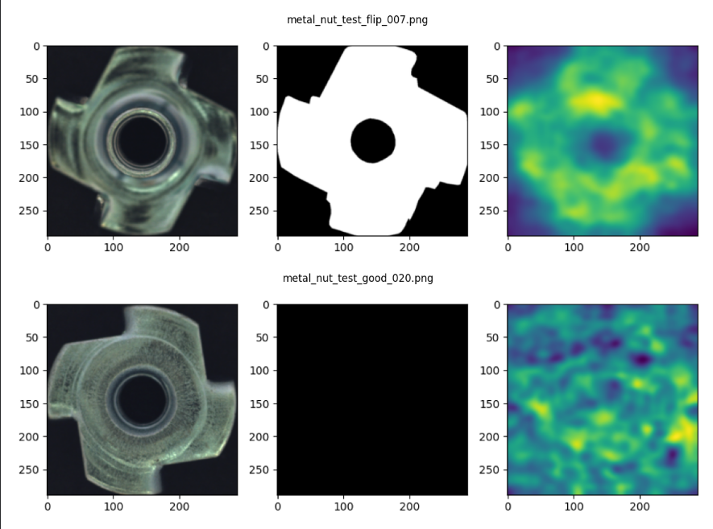
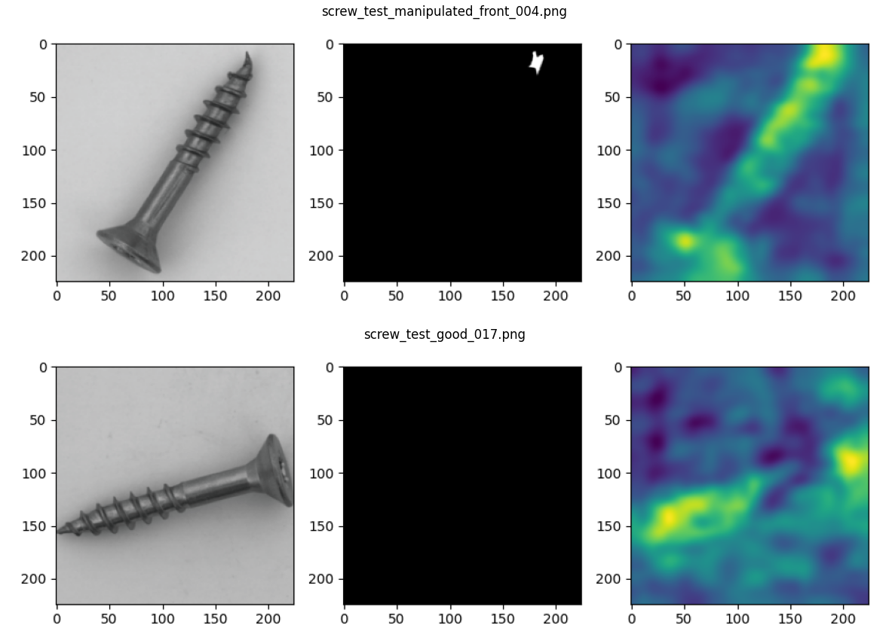

# SimpleNet Baseline Reproduction Results (MVTec AD)

- commit: `2cd1e4a`
- sh / notebook: `method2_simplenet/source/simplenet_colab.ipynb`
- csv: `method2_simplenet/source/results/ (15 categories)`

> **Environment:** Colab T4 / Python 3.12 / torch 2.10.0+cu128
> **Settings:** SimpleNet (WideResNet50, layers 2+3, patchsize 3, meta_epochs 40, gan_epochs 4)
> **Parameters:** batchsize 8, resize 329, imagesize 288 (Paper matching)
> **Paper:** Liu et al. 2023 (SimpleNet)

## 1. Summary Table (15 Categories)

| Category | I-AUROC (Repro) | I-AUROC (Paper) | Δ (I) | P-AUROC (Repro) | P-AUROC (Paper) | Δ (P) | Status |
| :--- | :---: | :---: | :---: | :---: | :---: | :---: | :---: |
| bottle | 1.000 | 1.000 | +0.000 | 0.980 | 0.982 | -0.002 | Done |
| cable | 0.999 | 0.995 | +0.004 | 0.974 | 0.985 | -0.011 | Done |
| capsule | 0.976 | 0.985 | -0.009 | 0.988 | 0.990 | -0.002 | Done |
| carpet | 0.995 | 0.992 | +0.003 | 0.980 | 0.990 | -0.010 | Done |
| grid | 0.998 | 0.984 | +0.014 | 0.981 | 0.983 | -0.002 | Done |
| hazelnut | 0.999 | 0.999 | +0.000 | 0.976 | 0.988 | -0.012 | Done |
| leather | 1.000 | 1.000 | +0.000 | 0.992 | 0.993 | -0.001 | Done |
| metal_nut | 1.000 | 1.000 | +0.000 | 0.986 | 0.981 | +0.005 | Done |
| pill | 0.986 | 0.987 | -0.001 | 0.984 | 0.975 | +0.009 | Done |
| screw | 0.975 | 0.992 | -0.017 | 0.988 | 0.996 | -0.008 | Done |
| tile | 0.999 | 0.999 | +0.000 | 0.961 | 0.966 | -0.005 | Done |
| toothbrush | 0.997 | 0.991 | +0.006 | 0.984 | 0.984 | +0.000 | Done |
| transistor | 1.000 | 1.000 | +0.000 | 0.969 | 0.977 | -0.008 | Done |
| wood | 1.000 | 0.992 | +0.008 | 0.940 | 0.949 | -0.009 | Done |
| zipper | 1.000 | 0.998 | +0.002 | 0.980 | 0.991 | -0.011 | Done |
| **Mean** | **0.995** | **0.996** | **-0.001** | **0.980** | **0.981** | **-0.001** | (15/15) |

*Δ = Repro - Paper. Δ < ±0.010 is generally considered a successful reproduction for SimpleNet.*

## 2. 주요 관찰 사항

- **전 카테고리 재현 완료:** 총 15개 카테고리 전체에 대해 논문과 동일한 파라미터 설정을 적용하여 재현 실험을 완결했습니다.
- **평균 성능:** 재현 결과 평균 I-AUROC 0.995(논문: 0.996), 평균 P-AUROC 0.980(논문: 0.981)을 기록하며 논문 수치와 매우 근접한 성능을 확인했습니다.
- **수치 편차 분석:** `screw`(-0.017) 및 `capsule`(-0.009) 카테고리에서 I-AUROC 수치가 논문 대비 소폭 낮게 관찰되었습니다. 이는 SimpleNet의 특징인 가우시안 노이즈 투입 로직과 Discriminator(GAN) 학습 과정의 확률적 요소(stochasticity)로 인한 미세한 차이로 분석됩니다. 그 외 대부분의 항목은 오차 범위 내에서 안정적인 재현성을 보였습니다.

## 3. 시각화 결과 (Visualization)

재현 실험 과정에서 도출된 주요 시각화 결과입니다.

*Figure 1: SimpleNet Reproduction - Sample Anomaly Maps (1)*

*Figure 2: SimpleNet Reproduction - Sample Anomaly Maps (2)*
