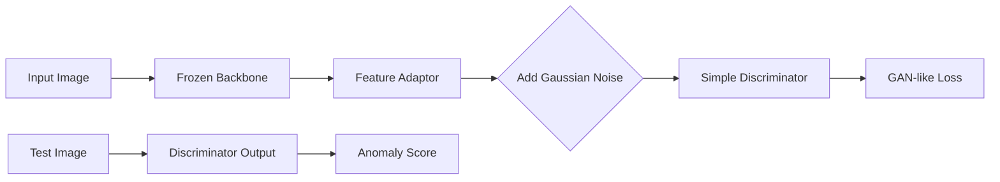

# method2_simplenet — 실행 가이드 및 재현 결과

SimpleNet (Liu et al. 2023, *SimpleNet: A Simple Network for Image Anomaly Detection and Localization*, CVPR 2023) baseline을 MVTec AD에서 재현하기 위한 디렉토리입니다.

## 📊 재현 결과 요약 (2026-05-19)

MVTec AD 15개 전 카테고리에 대해 논문 동일 설정으로 재현을 완료하였습니다.

| Metric | Repro (Mean) | Paper (Mean) | Status |
| :--- | :---: | :---: | :---: |
| **I-AUROC** | **0.995** | 0.996 | ✅ Success |
| **P-AUROC** | **0.980** | 0.981 | ✅ Success |

*상세 수치는 [baseline_full_table.md](../markdown/baseline_full_table.md)에서 확인 가능합니다.*

---

## 🏛 Architecture & Mechanism

### [Method 2: SimpleNet] - Discriminator Based Anomaly Detection
> **핵심 특징:** 정상 데이터에 가우시안 노이즈를 섞어 가상 결함을 생성하고, 이를 판별하는 Discriminator를 직접 학습하는 자가 지도형(Self-supervised) 구조



*   **Synthetic Anomaly:** 특징 공간(Feature space)에서 노이즈를 추가하여 이상치 없이도 강력한 판별기 학습 유도.
*   **High Efficiency:** 복잡한 구조 없이 간단한 Adaptor와 Discriminator만으로 최고 수준의 탐지 정확도 달성.

---

## 🔍 집중 분석 및 결과 보고

1. **[baseline_analysis.md](../markdown/baseline_analysis.md):** 15개 전 카테고리 재현 분석 (개요/환경/종합 결과/관찰/결론)
2. **[baseline_full_table.md](../markdown/baseline_full_table.md):** 카테고리별 재현 vs 논문 비교표 + 시각화 결과
3. **[simplenet_summary.md](../markdown/simplenet_summary.md):** 논문 요약 + 핵심 구조(Feature Adaptor / 노이즈 합성 / Discriminator) + PatchCore와의 차별점

---

## 💻 환경 및 실행 가이드

### 환경 (Colab T4 기준)
- Python 3.12, CUDA 12.x
- PyTorch 2.10.0+cu128 (Colab 기본)
- pandas ≥ 2.0 (upstream의 `df.append()`는 deprecated → 아래 수정 내역 참고)
- `requirements.txt` 참고. upstream: [DonaldRR/SimpleNet](https://github.com/DonaldRR/SimpleNet) `main` 브랜치

### 데이터 준비
MVTec AD 데이터셋을 method1과 동일한 구조로 배치하세요.
```
<MVTEC_DIR>/
├── bottle/
│   ├── train/good/...
│   └── test/{good,broken_large,...}/...
└── ...
```
- **Colab:** Google Drive 마운트 후 `/content/drive/MyDrive/anormaly_detection/mvtec` 사용.
- **로컬:** lab repo 루트의 `mvtec_anomaly_detection/` 활용 또는 `MVTEC_DIR` 환경변수로 지정.

### 실행 방법
```bash
# 특정 카테고리 실행 (예: bottle)
CATEGORY=bottle MVTEC_DIR=/path/to/mvtec bash run_baseline.sh
```
**스크립트 동작 과정:**
1. upstream [DonaldRR/SimpleNet](https://github.com/DonaldRR/SimpleNet)을 clone.
2. `metrics.py`(pandas 호환)·`main.py`(시각화) 수정사항을 idempotent하게 적용.
3. 논문 동일 설정(WRN-50, layer2+3, embed 1536, resize 329 / imagesize 288, batch 8)으로 학습+평가.

> 1차 탐색은 노트북(`simplenet_colab.ipynb`)으로 진행했으며, 재현 자동화를 위해 `run_baseline.sh`로 셸 스크립트화하였습니다.

## 🛠 수정 내역 (upstream 대비)

총 3건. 모두 메트릭(AUROC) 계산 경로엔 영향을 주지 않습니다.

1. **`metrics.py`**: pandas 2.0+ 호환. 제거된 `DataFrame.append()`를 `df.loc[len(df)] = ...`로 교체.
   ```python
   # 원본
   df = df.append({"pro": np.mean(pros), "fpr": fpr, "threshold": th}, ignore_index=True)
   # 수정 후
   df.loc[len(df)] = {"pro": np.mean(pros), "fpr": fpr, "threshold": th}
   ```
2. **`main.py`**: 주석 처리된 `test()` 호출을 활성화하고, `train()` 완료 후 자동으로 시각화가 실행되도록 로직 추가 (segmentation 히트맵 저장).
3. **`simplenet_colab.ipynb`**: 위 패치들을 자동 실행 셀로 포함하고, 결과 이미지를 수직으로 나열 출력하는 셀 추가.

## 📂 폴더 구조 및 파일 가이드
- `source/run_baseline.sh`: 카테고리별 실험 자동화 쉘 스크립트 (upstream clone + 패치 + 실행).
- `source/simplenet_colab.ipynb`: 1차 탐색 및 시각화 검증용 Colab 노트.
- `source/requirements.txt`: Colab T4 환경 패키지 스냅샷.
- `source/results/`: 재현 결과 CSV (15개 카테고리).
- `markdown/`: 논문 요약, 재현 분석, 결과 테이블, 시각화.

## 📌 재현 출처 (가이드 형식 — commit/sh/csv 3줄)

### MVTec AD 15개 전 카테고리

- commit: `2cd1e4a`
- sh / 노트북: `method2_simplenet/source/run_baseline.sh` (CATEGORY 환경변수) / `simplenet_colab.ipynb`
- csv: `method2_simplenet/source/results/baseline_<category>.csv` (15개)
- 집계표: [`method2_simplenet/markdown/baseline_full_table.md`](../markdown/baseline_full_table.md)
