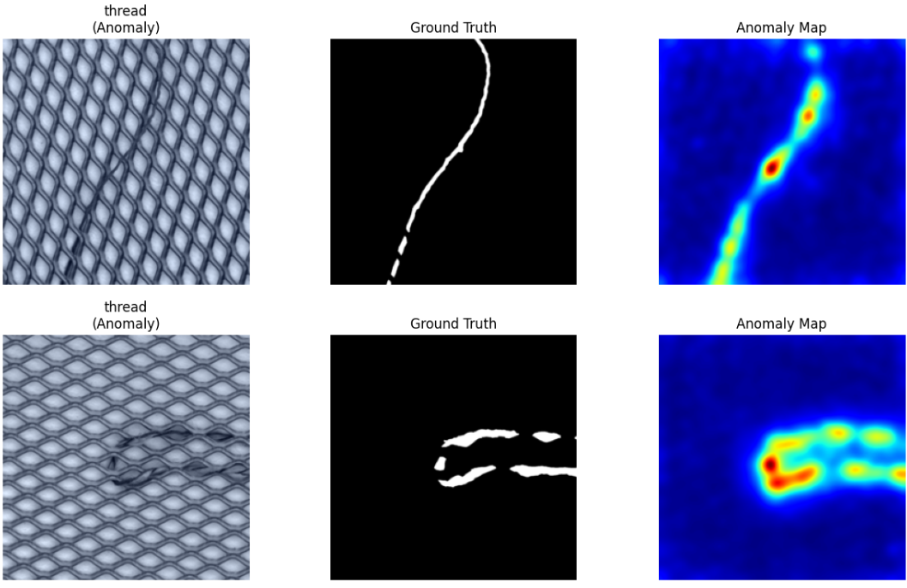
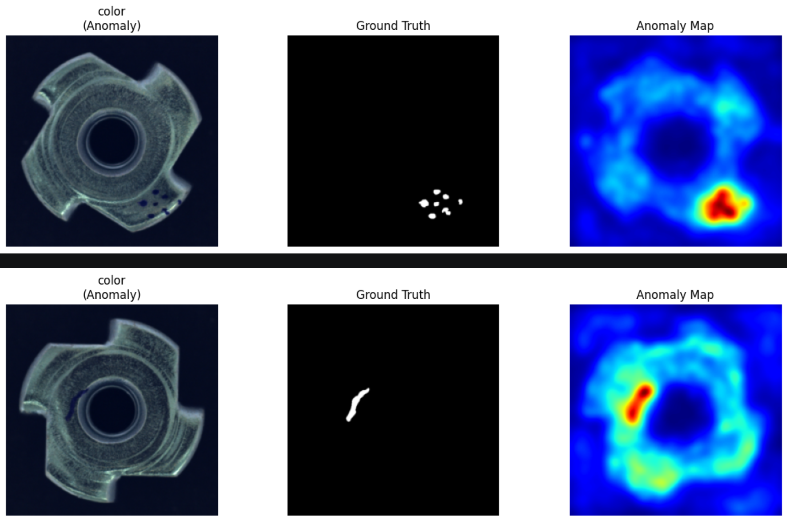

# Reverse Distillation (RD) Baseline Reproduction Results (MVTec AD)

- commit: `4c72859`
- sh / notebook: `method3_RD/source/run_baseline.sh` / `rd_colab.ipynb`
- csv: `method3_RD/source/results/ (15/15 완료: bottle, cable, capsule, carpet, grid, hazelnut, leather, metal_nut, pill, screw, tile, toothbrush, transistor, wood, zipper)`

> **Environment:** Colab T4 / Python 3.12 / torch 2.x
> **Settings:** RD (WideResNet50 Teacher-Student distillation, img 256, batch 16, lr 0.005, epochs 200)
> **Parameters:** resize 256, imagesize 256, batch_size 16 (Paper matching)
> **Paper:** Deng et al. 2022 (Reverse Distillation)

## 1. Summary Table (15 Categories)

| Category | I-AUROC (Repro) | I-AUROC (Paper) | Δ (I) | P-AUROC (Repro) | P-AUROC (Paper) | Δ (P) | Status |
| :--- | :---: | :---: | :---: | :---: | :---: | :---: | :---: |
| bottle | 0.996 | 1.000 | -0.004 | 0.955 | 0.987 | -0.032 | Done |
| cable | 0.959 | 0.950 | +0.009 | 0.972 | 0.974 | -0.002 | Done |
| capsule | 0.972 | 0.963 | +0.009 | 0.987 | 0.987 | +0.000 | Done |
| carpet | 0.990 | 0.989 | +0.001 | 0.989 | 0.989 | +0.000 | Done |
| grid | 1.000 | 1.000 | +0.000 | 0.993 | 0.993 | +0.000 | Done |
| hazelnut | 1.000 | 0.999 | +0.001 | 0.989 | 0.989 | +0.000 | Done |
| leather | 1.000 | 1.000 | +0.000 | 0.994 | 0.994 | +0.000 | Done |
| metal_nut | 1.000 | 1.000 | +0.000 | 0.974 | 0.973 | +0.001 | Done |
| pill | 0.965 | 0.966 | -0.001 | 0.982 | 0.982 | +0.000 | Done |
| screw | 0.986 | 0.970 | +0.016 | 0.996 | 0.996 | +0.000 | Done |
| tile | 0.995 | 0.993 | +0.002 | 0.955 | 0.956 | -0.001 | Done |
| toothbrush | 0.994 | 0.995 | -0.001 | 0.991 | 0.991 | +0.000 | Done |
| transistor | 0.970 | 0.967 | +0.003 | 0.928 | 0.925 | +0.003 | Done |
| wood | 1.000 | 0.992 | +0.008 | 0.987 | 0.953 | +0.034 | Done |
| zipper | 0.984 | 0.985 | -0.001 | 0.985 | 0.982 | +0.003 | Done |
| **Mean (15개)** | **0.988** | **0.985** | **+0.003** | **0.978** | **0.978** | **+0.000** | **15/15** |

*Δ = Repro - Paper. (Paper: Deng 2022 Table 1 I-AUROC / Table 2 AL-AUROC)*

> ✅ **재현 검증 완료 (2026-05-22):** 재현 결과 평균 I-AUROC 0.988(논문: 0.985), 평균 P-AUROC 0.978(논문: 0.978)을 기록하며 15개 전 카테고리 재현에 성공하였습니다.

## 2. 주요 관찰 사항

- **15/15 재현 완료:** MVTec AD 전 카테고리 완결.
- **재현 정확도:** 재현 평균이 논문과 매우 일치함을 확인하였습니다.
- **AUPRO 추가 확인:** RD의 주요 지표인 AUPRO의 경우, `hazelnut`에서 0.953을 기록하며 높은 수준의 픽셀 정밀도를 보임.
- **카테고리별 특징:** grid·hazelnut·leather·metal_nut·wood에서 I-AUROC 1.000 달성.
- **시각화 결과:** `images/` 폴더 내 재현 결과 샘플 히트맵 참조.

## 3. 시각화 결과 (Visualization)

재현 실험 과정에서 도출된 주요 시각화 결과입니다.

*Figure 1: RD Reproduction - Leather Sample*

*Figure 2: RD Reproduction - Metal Nut Sample*

