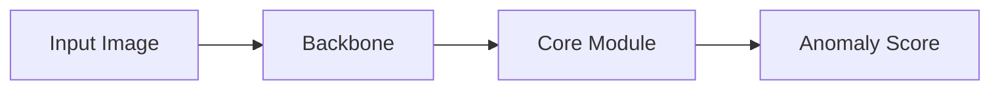

# method4_Dinomaly — 실행 가이드 및 재현 결과

Dinomaly baseline을 MVTec AD에서 재현하기 위한 디렉토리입니다.

## 📊 재현 결과 요약

> ⏳ **진행 중** — 환경 구축 및 bottle 카테고리 sanity check 수행 중.

| Metric | Repro (Mean) | Paper (Mean) | Status |
| :--- | :---: | :---: | :---: |
| **I-AUROC** | — | — | 🔄 진행 중 |
| **P-AUROC** | — | — | 🔄 진행 중 |

*상세 수치는 재현 완료 후 [baseline_full_table.md](../markdown/baseline_full_table.md)에서 확인 가능합니다.*

---

## 🏛 Architecture & Mechanism

### [Method 4: Dinomaly] - (아키텍처 설명 추가 예정)
> **핵심 특징:** (논문 분석 후 작성 예정)



*   **(아키텍처 상세 설명 — 논문 분석 후 작성 예정)**

---

## 🔍 집중 분석 및 결과 보고

1. **[dinomaly_summary.md](../markdown/dinomaly_summary.md):** 논문 요약 (작성 예정)

---

## 💻 환경 및 실행 가이드

### 환경 (Colab T4 기준)
- Python 3.12, CUDA 12.x
- PyTorch 2.x (Colab 기본)
- upstream: (확정 후 기재)

### 데이터 준비
method1~3과 동일한 MVTec AD 구조.
```
<MVTEC_DIR>/
├── bottle/
│   ├── train/good/...
│   └── test/{good,broken_large,...}/...
└── ...
```
- **Colab:** Google Drive 마운트 후 경로 지정.
- **로컬:** lab repo 루트의 `mvtec_anomaly_detection/` 활용 또는 `MVTEC_DIR` 환경변수로 지정.

### 실행 방법
```bash
# 특정 카테고리 실행 (예: bottle)
CATEGORY=bottle MVTEC_DIR=/path/to/mvtec bash run_baseline.sh
```
**스크립트 동작 과정:**
1. upstream repo를 clone.
2. 필요 시 수정사항 적용.
3. 지정 카테고리에 대해 학습+평가 실행.

## 🛠 수정 내역 (upstream 대비)

> 수정 내역은 실험 진행 후 기재 예정.

## 📂 폴더 구조 및 파일 가이드
- `source/README.md`: 실행 가이드 및 재현 결과 (본 문서).
- `source/run_baseline.sh`: 카테고리별 실험 자동화 쉘 스크립트 (작성 예정).
- `source/requirements.txt`: Colab T4 환경 패키지 스냅샷 (작성 예정).
- `source/results/`: 재현 결과 CSV.
- `markdown/`: 논문 요약, 재현 분석, 결과 테이블, 시각화.

## 📌 재현 출처 (가이드 형식 — commit/sh/csv 3줄)

### MVTec AD (진행 중)

- commit: (실험 완료 후 기재)
- sh / 노트북: `method4_Dinomaly/source/run_baseline.sh` / (노트북명)
- csv: `method4_Dinomaly/source/results/baseline_<category>.csv`
- 집계표: [`method4_Dinomaly/markdown/baseline_full_table.md`](../markdown/baseline_full_table.md)
