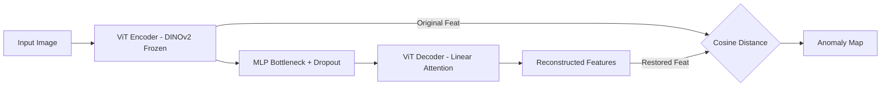

# method4_Dinomaly — 실행 가이드 및 재현 결과

Dinomaly (Guo et al. 2025, *Dinomaly: The Less Is More Philosophy in Multi-Class Unsupervised Anomaly Detection*, CVPR 2025) baseline을 MVTec AD에서 재현하기 위한 디렉토리입니다.

## 📊 재현 결과 요약

> ✅ **재현 완료** — MVTec AD 15개 전 카테고리 재현 완결 (2026-05-25).

| Metric | Repro (Mean) | Paper (Mean) | Status |
| :--- | :---: | :---: | :---: |
| **I-AUROC** | **0.9962** | 0.996 | ✅ 완결 |
| **P-AUROC** | **0.9832** | 0.984 | ✅ 완결 |

*상세 수치는 재현 완료 후 [baseline_full_table.md](../markdown/baseline_full_table.md)에서 확인 가능합니다.*

---

## 🏛 Architecture & Mechanism

### [Method 4: Dinomaly] - Minimalist Reconstruction Based Anomaly Detection
> **핵심 특징:** DINOv2 사전학습 ViT Encoder의 중간층 feature를 Dropout 병목 + Linear Attention Decoder로 복원하며, 정상과 다른 '복원 실패' 오차를 감지하는 순수 Transformer 구조. Multi-class 통합 모델.



*   **Noisy Bottleneck:** MLP 내장 Dropout(p=0.2)으로 feature를 무작위 마스킹 → denoising 효과로 identity mapping 차단.
*   **Linear Attention:** Softmax 없이 attention을 분산시켜 동일 위치 정보 전달을 방지, 계산량도 절감.
*   **Loose Reconstruction:** 다층 feature를 그룹으로 묶어 느슨하게 복원 + hard mining loss로 이미 잘 복원된 영역의 gradient 축소.

---

## 🔍 집중 분석 및 결과 보고

1. **[dinomaly_summary.md](../markdown/dinomaly_summary.md):** 논문 요약 + 핵심 구조(Foundation ViT / Noisy Bottleneck / Linear Attention / Loose Reconstruction) + PatchCore·SimpleNet·RD와의 차별점

---

## 💻 환경 및 실행 가이드

### 환경 (Colab T4 기준)
- Python 3.12, CUDA 12.x
- PyTorch 2.x (Colab 기본)
- upstream: [guojiajeremy/Dinomaly](https://github.com/guojiajeremy/Dinomaly) (공식 구현체)

### 데이터 준비
method1~3과 동일한 MVTec AD 구조.
```
<MVTEC_DIR>/
├── bottle/
│   ├── train/good/...
│   └── test/{good,broken_large,...}/...
└── ...
```
- **Colab:** Google Drive 마운트 후 경로 지정.
- **로컬:** lab repo 루트의 `mvtec_anomaly_detection/` 활용 또는 `MVTEC_DIR` 환경변수로 지정.

### 실행 방법
```bash
# 특정 카테고리 실행 (예: bottle)
CATEGORY=bottle MVTEC_DIR=/path/to/mvtec bash run_baseline.sh
```
**스크립트 동작 과정:**
1. upstream [guojiajeremy/Dinomaly](https://github.com/guojiajeremy/Dinomaly)을 clone.
2. 필요 시 수정사항 적용.
3. 논문 기본 설정(ViT-Base/14, DINOv2-R, resize 448 / crop 392, 10,000 iterations)으로 학습+평가.

> 1차 탐색 및 재현은 김준아 학생의 fork 기반 패치 로직을 적용한 통합 노트북(`dinomaly.ipynb`)으로 완결.

## 🛠 수정 내역 (upstream 대비)

1. **`utils.py` 패치**: 최신 Pandas(2.0+) 호환성을 위해 `df.append()`를 `pd.concat()`으로 수정.
2. **CUDA 디바이스 자동화**: 단일 GPU 환경(Colab 등) 호환을 위해 `cuda:1` 하드코딩을 자동 감지 로직으로 변경.
3. **카테고리별 실행 옵션**: 특정 카테고리만 학습/평가할 수 있도록 `--category` 인자 및 필터링 로직 추가.
4. **시각화 자동화**: 학습 완료 후 `visualize()` 함수를 호출하여 `./visualize` 폴더에 결과를 자동 저장하도록 개선.

## 📂 폴더 구조 및 파일 가이드
- `source/dinomaly.ipynb`: 전체 프로세스(클론, 패치, 학습, 시각화) 통합 실행 노트북.
- `source/run_baseline.sh`: 카테고리별 실험 자동화를 위한 셸 스크립트.
- `source/requirements.txt`: 실행 환경 패키지 스냅샷 (사용자 제공 예정).
- `source/results/`: 재현 결과 CSV.
- `markdown/`: 논문 요약, 재현 분석, 결과 테이블, 시각화.

## 📌 재현 출처 (가이드 형식 — commit/sh/csv 3줄)

### MVTec AD (진행 중)

- commit: (실험 완료 후 기재)
- sh / 노트북: `method4_Dinomaly/source/run_baseline.sh` / (노트북명)
- csv: `method4_Dinomaly/source/results/baseline_<category>.csv`
- 집계표: [`method4_Dinomaly/markdown/baseline_full_table.md`](../markdown/baseline_full_table.md)
